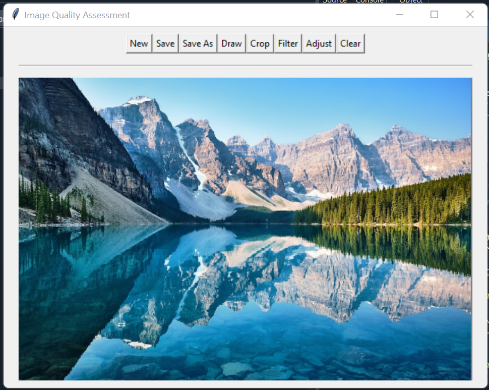
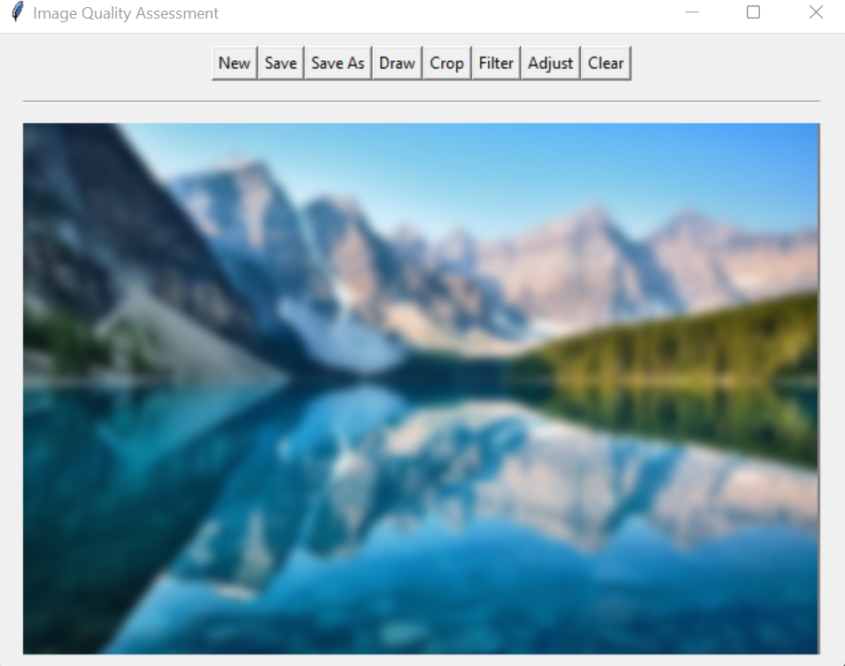

# Image Quality Assessment Software (IQA)

A desktop application software built to detect quality of images and response accordingly, IQA can blur the image by reducing pixel metrics & reduce noise from the image if detects. Technologies used - Spyder IDE, Python, GUI (Graphical User Interface) - Tkinter

Software Used :  
IDE - Spyder (anaconda 3)  
Language - python version 3.9  
GUI - Tkinter  

# Result  

<table align="center">
  <tr>
    <td align="center">
       
      <em>Clean Image: Main Interface of IQA with clean image</em>
    </td>
    <td align="center">
       
      <em>Result : Converted Clean image to Blurry</em>
    </td>
  </tr>
</table>  

<table align="center">
  <tr>
    <td align="center">
       
      <em>Noisy Image: Image with a lot of Noise</em>
    </td>
    <td align="center">
       
      <em>Result : Image after Noise Reduction</em>
    </td>
  </tr>
</table>  
